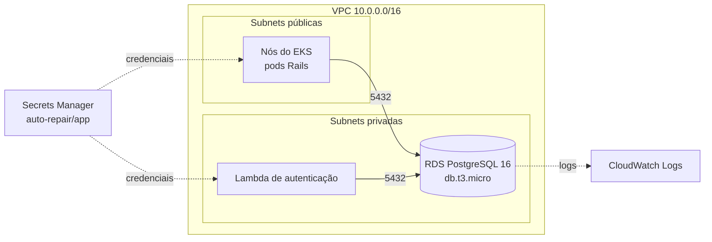

# auto-repair-infra-database

Banco de dados gerenciado do sistema de gestão de oficina mecânica
(Tech Challenge — Fase 3, FIAP postech).

**Segundo** repositório na ordem de aplicação: depende da VPC criada por
[`auto-repair-infra-k8s`](https://github.com/IgorSantosXP/auto-repair-infra-k8s),
lida via estado remoto.

## Propósito

| Recurso | Função |
|---|---|
| `aws_db_instance` | PostgreSQL 16 gerenciado, `db.t3.micro`, armazenamento criptografado |
| `aws_db_subnet_group` | Coloca a instância nas subnets **privadas**, sem rota para a internet |
| `aws_security_group` | Libera a porta 5432 apenas para dentro da VPC |
| `aws_db_parameter_group` | Registra queries acima de 500 ms para análise de performance |
| `aws_secretsmanager_secret` | Credenciais do banco + segredo JWT compartilhado entre a Lambda e a aplicação |

## Arquitetura



## Por que PostgreSQL

A justificativa formal, o diagrama ER e os ajustes no modelo relacional estão em
[`auto-repair-api/docs/database`](https://github.com/IgorSantosXP/auto-repair-api/tree/main/docs/database).
Em resumo: o domínio é fortemente relacional (cliente → veículo → ordem de
serviço → itens → movimentações de estoque), exige transações ACID no débito de
estoque e no fechamento de orçamento, e o histórico de status depende de
integridade referencial. PostgreSQL também já era o banco das Fases 1 e 2, o que
elimina risco de migração.

## Ambientes

A instância hospeda **dois bancos** no mesmo servidor, um por ambiente:

| Ambiente | Banco | Namespace no cluster |
|---|---|---|
| Produção | `auto_repair_prod` | `auto-repair-prod` |
| Homologação | `auto_repair_homolog` | `auto-repair-homolog` |

O banco de produção é criado pelo próprio RDS (`db_name`). O de homologação é
criado pelo `rails db:prepare` do Job de migração ao subir aquele namespace.
Uma instância para os dois ambientes é uma decisão consciente de custo: separar
dobraria a conta sem agregar nada à avaliação.

## Tecnologias

Terraform 1.10+, AWS RDS, AWS Secrets Manager.

## Pré-requisitos

1. `auto-repair-infra-k8s` aplicado (a VPC precisa existir)
2. Perfil AWS: `aws configure --profile auto-repair`

## Execução

```bash
make init
make plan
make up       # ~10 min para o RDS ficar disponível
make outputs
make secret   # imprime as credenciais geradas (requer jq)
```

Para destruir:

```bash
make down
```

> **Custo.** `db.t3.micro` sai por ~US$ 14/mês fora do free tier, ou gratuito
> nos 12 primeiros meses da conta. É o recurso mais barato do projeto, mas
> ainda assim rode `make down` ao terminar.

## Segurança

- Instância **não** publicamente acessível, em subnet privada sem rota de saída
- Armazenamento criptografado em repouso (KMS gerenciado pela AWS)
- Senha de 32 caracteres gerada pelo Terraform, nunca versionada
- Credenciais no Secrets Manager, lidas em tempo de `apply` pelos outros
  repositórios e injetadas como Secret do Kubernetes e variável da Lambda

O security group libera 5432 para o CIDR inteiro da VPC, e não para security
groups específicos. É deliberado: referenciar o SG dos nós e o da Lambda criaria
dependência circular entre três repositórios. Como as subnets privadas não têm
rota para a internet e a VPC é dedicada a este projeto, a superfície exposta
continua sendo apenas interna.

## Saídas publicadas

`db_endpoint`, `db_port`, `db_name`, `db_username`, `db_security_group_id`,
`secret_arn`, `secret_name`.

## CI/CD

`.github/workflows/terraform.yml` — `plan` em pull request, `apply` no push para
`main`, autenticando na AWS por **OIDC** (sem access key nos Secrets).

## Documentação arquitetural

Diagramas, ADRs, RFCs e modelo de dados do sistema completo:
**[índice da documentação](https://github.com/IgorSantosXP/auto-repair-api/tree/main/docs)**.

## API

Collection da API no repositório da aplicação:
[Swagger UI](https://github.com/IgorSantosXP/auto-repair-api#documentação-da-api).
